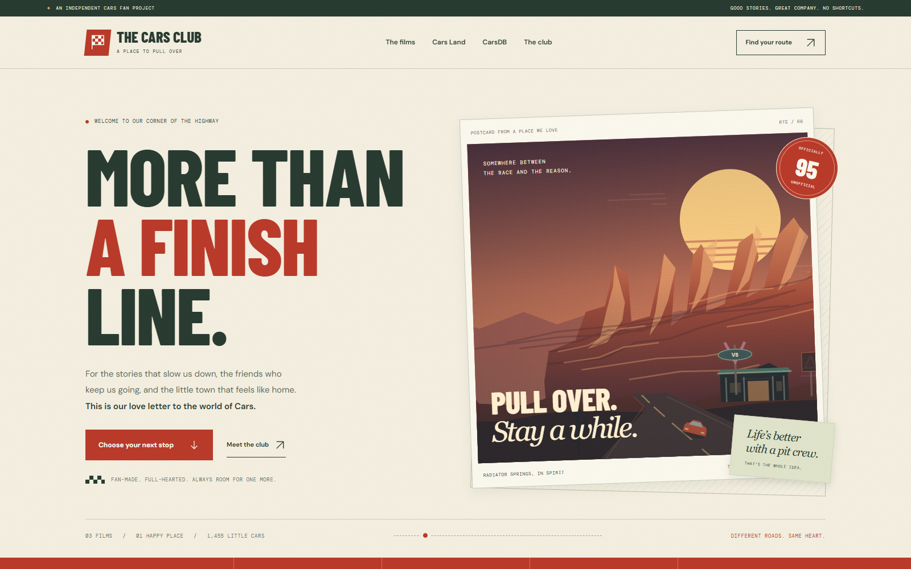
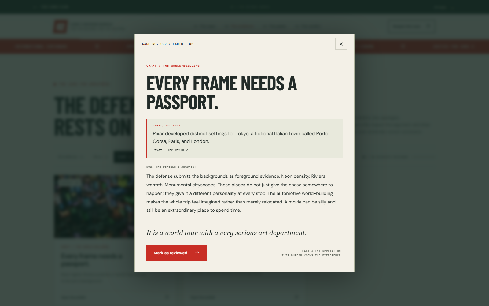
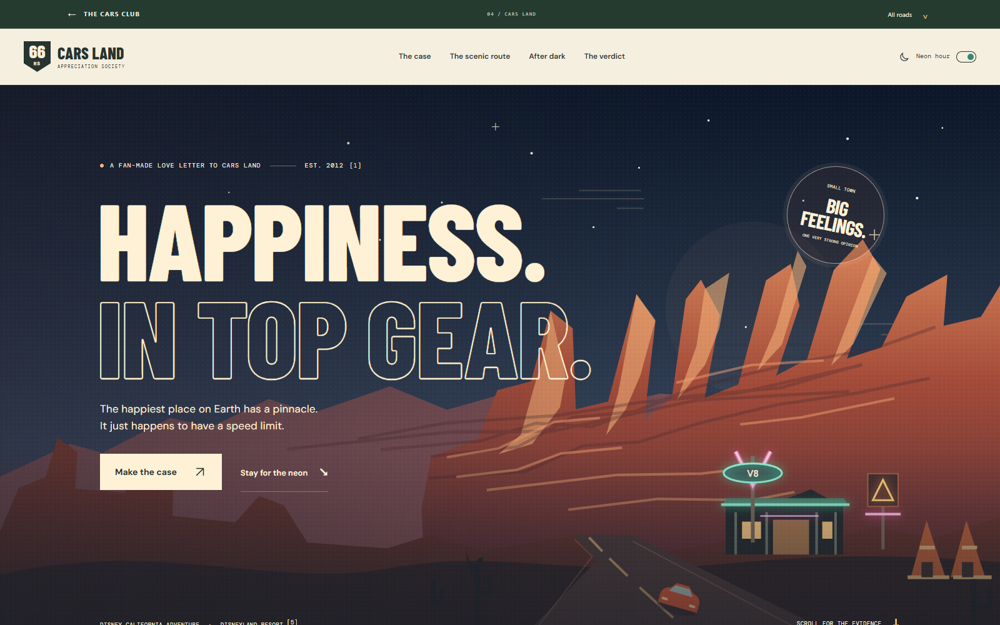

# The Cars Club

**Five roads through the world of Cars, each with its own point of view.**

The Cars Club is a collection of illustrated, interactive fan pages built with plain HTML, CSS, JavaScript, and SVG. Explore a character-focused essay, a playful defense dossier, a mentorship story, an imagined day at Cars Land, or an introduction to a separate die-cast catalogue.

There is no build step or backend. The gallery homepage connects five destination pages with shared navigation and an on-device roadbook.



*The gallery homepage, captured from the source revision described below.*

## Pick a road

| Destination | What you can explore |
| --- | --- |
| **[The Scenic Route](cars/)** | The original Cars through rookie and veteran perspectives, with switchable sections and a reflection you can save on your device. |
| **[Cars 2 Defense Bureau](cars-2/)** | A playful collection of evidence cards, location tabs, review markers, a verdict, and a printable dossier. |
| **[The Next Lap](cars-3/)** | Cars 3, aging, and mentorship, including character tabs and a reversible “pass the torch” perspective. |
| **[Cars Land Appreciation Society](cars-land/)** | An illustrated park visit with day/night/sunset views, stop selections, optional photographs, and a saved dream lap. |
| **[CarsDB introduction](carsdb/)** | A hand-authored introduction to the separate [CarsDB catalogue](https://cars.arrangedgodly.com/), with illustrated example entries. |

The homepage's route finder helps you choose a destination. **Surprise** suggests a random route. **All roads** opens the shared navigation, and each destination's next-stop link continues the loop.

## Explore the pages

### Change your perspective

The Scenic Route lets you switch between rookie, veteran, and combined viewpoints, then leave an optional reflection. The Next Lap uses character tabs and its pass-the-torch interaction to revisit the story from another angle.

The Next Lap's reflection prompts are displayed as text; it does not include the older encouragement-note form.

### Make a case for Cars 2

Filter the Defense Bureau's dossier cards by category, open a card, mark what you have reviewed, and explore Tokyo, Porto Corsa, and London. Save a local verdict, use the explicit copy action for its copypasta, or open the browser's print dialog for the dossier.



*The world-building dossier opened through its real page control.*

### Plan an imaginary Cars Land lap

Switch the illustrated scene between day, sunset, and night. Explore five attraction/dining stops, save your preferred stops, and optionally switch to remote photographs. Your saved lap and verdict stay in this browser's local storage.



*The illustrated night view after changing the scene through the page controls.*

## What stays on your device

There are no accounts, backend submissions, or analytics/tracking scripts in the inspected source. Interactive state is stored locally by the browser.

| State | Storage key |
| --- | --- |
| Shared visited-page roadbook | `cars-club.roadbook.v1` |
| Scenic Route reflection | `scenic-route.reflection.v1` |
| Cars 2 reviewed cards and verdict | `cars2-defense-bureau-v1` |
| Cars Land stops, theme, and verdict | `cars-land-appreciation-society:v1` |

The roadbook records that you opened a page, not that you read it. Its reset clears only the shared roadbook key; it does not erase the separate reflections or saved choices on individual pages. Cars 3 and the CarsDB introduction still update the shared roadbook even though they have no separate page-specific storage.

**External requests still occur.** Google Fonts and several remote film/concept images are referenced across the site. Cars Land's photograph mode requests its external photographs when selected. Local illustrations and image-error fallbacks exist, but this is not a claim that every page has been fully tested offline.

## This is not the CarsDB application

The `/carsdb/` page introduces and links to a different project at [cars.arrangedgodly.com](https://cars.arrangedgodly.com/). It does not query or store the live catalogue, and it does not implement the catalogue's collection-management features.

Its displayed counts and example ratings are a **September 2026 snapshot**, not live statistics. Keep that date attached when editing or discussing them.

## Run locally

Clone the repository and serve its root with Python:

```bash
git clone https://github.com/Arrangedgodly/cars-fp.git
cd cars-fp
python3 -m http.server 8000 --bind 127.0.0.1
```

Open <http://127.0.0.1:8000/>. Use `python` instead of `python3` if that is your installed command.

Opening `index.html` directly is also supported by the link-handling code, but a local server gives more consistent origin and storage behavior. There is no package install or bundling step.

For static hosting, publish the repository contents without changing the directory layout. Serve each directory's `index.html` and configure not-found handling for `404.html`. This is a multi-page site, not a single-page app requiring all routes to rewrite to the homepage.

## Editing map

| Path | Purpose |
| --- | --- |
| `index.html` | Gallery homepage. |
| `cars/`, `cars-2/`, `cars-3/` | The three film-focused pages. |
| `cars-land/` | Park appreciation page and interactions. |
| `carsdb/` | Static catalogue introduction. |
| `assets/club-shell.js` | Shared navigation, link handling, and roadbook state. |
| `assets/hub.js` | Homepage route-finder interactions. |
| `assets/*.svg` | Local illustrations and favicon. |
| `404.html` | Not-found page. |

The source includes responsive navigation, native disclosure/dialog elements, ARIA tabs, keyboard handlers, and reduced-motion-aware behavior. Their presence is not an accessibility-conformance certification.

## Verification

This README was prepared from source commit `48d52327b28845a7b763362c519703ce26415276`. The earlier README records historical browser/reference checks; those should not be mistaken for a new comprehensive test pass.

A fresh local capture pass used Chrome 154.0.8037.93 and isolated browser state. All six routes rendered at a 1600-pixel desktop width without page script errors or horizontal overflow; the gallery also fit at 390 pixels.

The pass exercised Cars 2's Craft filter and world-building dossier, Cars Land's night/day controls, and the shared roadbook reset. Reset cleared the shared roadbook while preserving the separate task-created Cars Land state. Google Fonts and remote film imagery loaded during these captures.

The three README screenshots retain their original **1600 × 1000** pixels. Offline fallback, clipboard, printing, reflections, dream-lap controls, and physical mobile behavior were not tested. These focused checks do not constitute a full accessibility or cross-browser audit.

## Fan-project credits

This is an unofficial fan project, not affiliated with or endorsed by Disney, Pixar, or Mattel. Characters, images, names, and trademarks belong to their respective owners. Per-page sources and credits are retained in the site.

The stylized local illustrations are described as original fan art and do not represent specific Mattel releases. Rankings and superlatives express fan opinion. The repository does not include a root license granting general reuse rights; do not assume a code or asset license from its public availability.
